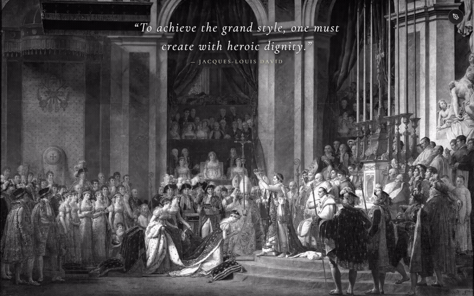
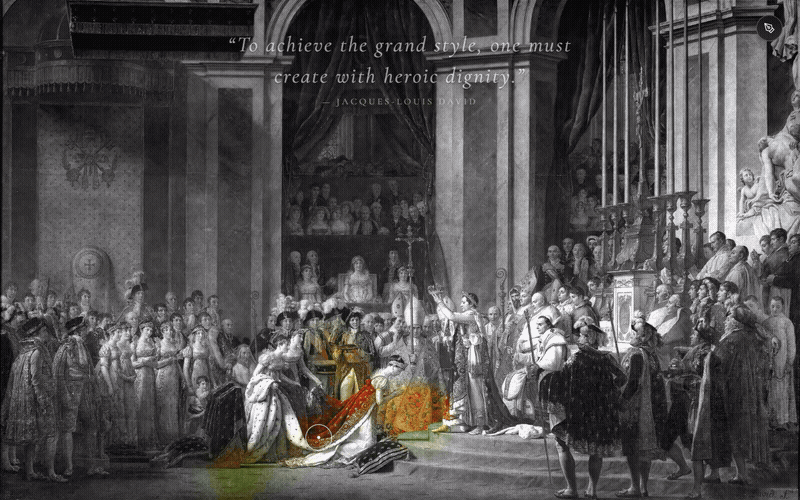
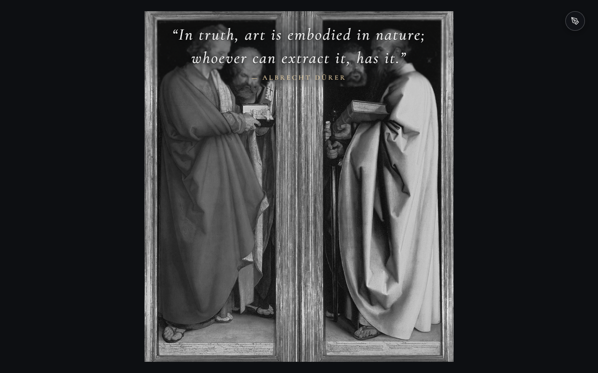
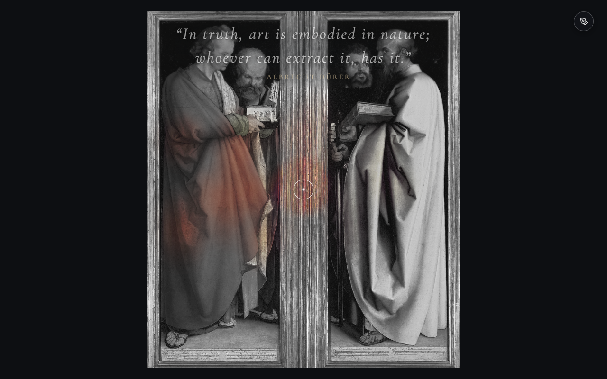
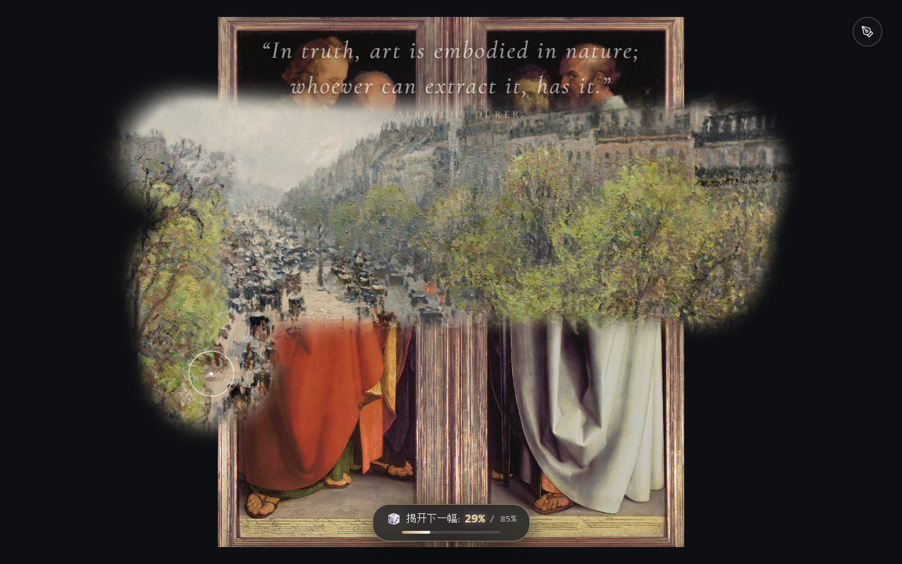
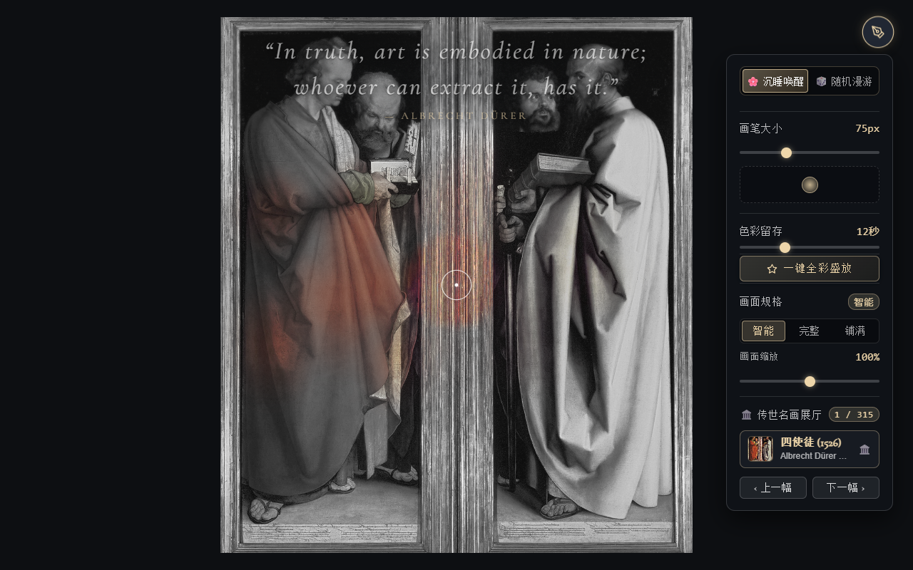

# 🎨 Slumbering Masterpieces (沉睡的名画)

> **Fine Arts Digital Exhibition · An Interactive Chromatic Awakening & Random Wander**  
> *“I must have flowers, always, and always.” —— Claude Monet*  
> *触碰沉睡的静谧灰阶，用指尖的温度唤醒绚烂盛放；或挥毫漫游擦拭画卷，在图层交错间探寻下一幅旷世杰作。*

[](https://opensource.org/licenses/MIT)
[](#)
[](#)
[](#)
[](#)

---

## 🎬 效果演示 (Live Demonstrations)

| 🌸 沉睡唤醒模式 (Dormant Awakening) | 🎲 随机漫游擦除模式 (Random Wander) |
| :---: | :---: |
|  |  |
| *触碰静谧灰阶素描，用指尖唤醒绚烂真彩* | *挥毫擦除顶层画作，达到阈值优雅展现下一幅* |
| [▶️ 观看唤醒高清视频演示 (MP4)](assets/demo/demo-awakening.mp4) | [▶️ 观看漫游高清视频演示 (MP4)](assets/demo/demo-wander.mp4) |

> 📹 **全流程高清演示视频**：[assets/demo/demo-full-showcase.mp4](assets/demo/demo-full-showcase.mp4)  
> 完整收录：双模式一键切换、画笔轨迹渐进色彩唤醒、焦点停驻充能绽放、画笔大小调节、随机漫游画作擦除、达到 85% 阈值平滑展开新画的全流程交互。

<details>
<summary><b>📸 点击展开查看高分辨率静止效果截图与控制面板</b></summary>
<br>

| 1. 初始古典静谧灰阶素描 | 2. 唤醒盛放效果对比 |
| :---: | :---: |
|  |  |

| 3. 随机漫游双画擦除交错 (实时 HUD 进度) | 4. 典雅香槟金控制抽屉与 315 幅名画展厅 |
| :---: | :---: |
|  |  |

</details>

---

## 🖼️ 艺术理念 (Artistic Philosophy)

《**Slumbering Masterpieces · 沉睡的名画**》是一件融合欧洲古典油画美学、空间状态衰减网格与数字图形学交互的传世名画级网络艺术装置。现已升级为**双重交互体验**：

- **🌸 沉睡唤醒 (Dormant Awakening)**：在未经触碰时，整幅画卷呈现为沉静肃穆的古典灰阶素描底稿，纤毫毕现却隐去了所有色彩；随着观者的指尖拂过，沉睡的生机被层层点亮，并在静止后如晨雾般优雅消散，再度归于古典的宁静；
- **🎲 随机漫游 (Random Wander & Scratch)**：原画真彩直出，无需灰阶。画笔在屏幕轻扫移动时，将当前的传世名画如同古老壁画般逐笔擦去，优雅显露出背后静静等候的下一幅随机世界名画，带来探秘式的无尽艺术巡礼。

---

## ✨ 核心交互设计 (Interactive Highlights)

### 1. 🎛️ 双模式自由切换与清爽分段控制器 (Dual Mode Segmented Control)
点击右下角精致的**羽毛画笔控制图标**，面板顶部常驻清爽直观的分段切换器（Segmented Control）：
- **🌸 沉睡唤醒**：经典模式，灰阶底稿、渐进显色、焦点充能、晨雾淡出；
- **🎲 随机漫游**：全新模式，原画全彩、划动擦除、露出底图、阈值展开。
当前激活模式以雅致的香槟金微光边框与高亮底色实时反馈，彻底告别视觉冗余。

---

### 2. 🎲 随机漫游擦画模式核心机制 (Random Wander & Scratch Mode)

- **纯净原画全彩（无灰阶）**：
  顶层当前画作与底层背后的随机新画均呈现 100% 原始璀璨真彩，保留细腻的大师笔触与质感；
- **空间平滑擦除挖空**：
  画笔掠过之处，顶层遮罩按高斯平滑曲线自然衰减，直接透出底层对应的画作细节；
- **自主可调完全展现阈值（默认 85%）**：
  当擦拭露出的面积比例达到设定阈值时（默认 85%，控制台支持 **50% ~ 95%** 任意滑块微调），画面将自动触发 480ms 的三次缓动（Cubic-Ease）平滑展开动画，将剩余遮罩消退至 100% 完整展现新画；
  控制台亦配备 **【✨ 立即完全展开下一幅】** 按钮，支持随时一键绽放；
- **严格防半途擦除状态机锁定**：
  **严格守护核心原则**：*一幅画必须完全展示出来后，画笔涂抹才能擦去它！*  
  在自动展开动画过渡期间或新画尚未就绪前，状态机立即执行强锁定，忽略一切擦拭事件；只有在新画完好晋升为顶层画作、底层全新随机候选画在后台预热绘制就绪后，画笔才正式解锁，绝无半途错乱；
- **全屏暗色画廊防漏底体系**：
  针对不同名画长宽规格差异（竖版如《圣母加冕》、横版如《睡莲》），顶层在合成阶段先行铺设深色画廊背景（`#0d0f12`），配合遮罩统一混合，确保在完整（Contain）或自定义缩放下**四周留白处绝对不穿帮漏出底图**；
- **视口悬浮实时 HUD**：
  屏幕底部配备典雅的半透明磨砂进度胶囊，微光进度条实时展示当前已擦除比例与目标阈值。

---

### 3. 🌸 经典沉睡唤醒模式机制 (Dormant Awakening Mode)

- **多层划动渐进显色 (Multi-Pass Progressive Reveal)**：
  单次滑过仅透出约 25% 浅彩，主体依旧保持素描质感；需在同一区域来回擦拭 3~4 次，色彩方层层累加浸润达到 100% 鲜艳原色；
- **停驻充能绽放 (Hover Focus Charge)**：
  光标停留在原地超过 40ms 即触发焦点充能，0.4~0.5 秒迅速自内向外饱满盛开；悬停之处永不消退；
- **超长色彩留存与晨雾淡出 (Luminescent Hold & Foggy Decay)**：
  默认保持 **8.5 秒**完全不褪色，随后在 **3.5 秒**内按非线性余弦曲线如晨雾般自然淡退为黑白素描（总时长 4~30 秒无级可调）；
- **一键全彩盛放与恢复沉睡**：
  控制面板支持一键将整幅画卷瞬间还原为 100% 常驻全彩，或一键重归静谧黑白素描。

---

### 4. 📐 画面规格自适应与无级缩放微调 (Aspect Ratio Fit & Free Scaling)

两种模式下均支持观者自主决定最佳构图：
- **【智能 (Auto)】**：横屏遇到竖幅名画（如 0.7:1 肖像立轴）自动采用完整呈现，横屏横画铺满全屏，杜绝重要画面被剧烈裁剪；
- **【完整 (Contain)】**：整幅名画 100% 完整容纳于视口内，四周留有雅致的古典深色画廊留白；
- **【铺满 (Cover)】**：无边框全景沉浸铺满整张屏幕；
- **【画面缩放 (Scale)】**：配备 **60% ~ 140%** 无级缩放滑块，既可缩小纵览全图，亦可放大深入品鉴大师笔触细节。

---

### 5. 🏛️ 315 幅传世著名油画博览馆 · 8 大艺术史时代展厅

控制面板内置**【传世名画博览馆】**，共收录 **315 幅世界级殿堂油画旷世杰作**（严格依据《[选画规范](docs/ART_SELECTION_SPEC.md)》收录出名油画，新增圣经史诗名作《摩西在西奈山领受律法》、帝国肖像巅峰《王座上的拿破仑一世》以及 20 幅享誉世界的希腊神话殿堂油画，彻底剔除现代主义抽象与非油画媒介）。支持下拉展厅快速跳转与 **‹ 上一幅 / 下一幅 ›** 便捷翻阅，上方诗意名言与画家署名**实时联动更新**：

1. **🏛️ 文艺复兴与北方画派 (Renaissance & Northern Masters · 62幅)**：收录提香《劫夺欧罗巴》《维纳斯与阿多尼斯》、波提切利《战神与维纳斯》、老勃鲁盖尔《伊卡洛斯的坠落》、科雷吉欧《勒达与天鹅》等神话里程碑
2. **🎭 巴洛克与荷兰黄金时代 (Baroque & Dutch Golden Age · 44幅)**：收录卡拉瓦乔《水仙少年纳喀索斯》、伦勃朗《达那厄》、鲁本斯《帕里斯的裁判》《被缚的普罗米修斯》《珀耳修斯拯救安德洛墨达》、委拉斯凯兹《火神的锻造厂》、普桑《阿波罗与达芙妮》等
3. **⚡ 新古典、洛可可与浪漫主义 (Neoclassicism & Romanticism · 45幅)**：收录热罗姆《摩西在西奈山领受律法》、安格尔《王座上的拿破仑一世》《俄狄浦斯与斯芬克斯》《朱庇特与忒提斯》、布歇《狄安娜出浴》、热拉尔《丘比特与普赛克》、布格罗《维纳斯的诞生》、沃特豪斯《奥德修斯与塞壬》《回声与水仙花》等
4. **🌾 写实主义与巡回展览画派 (Realism & Wanderers · 14幅)**：收录柯罗《俄耳甫斯引领欧律狄刻走出冥界》等
5. **🌟 克劳德·莫奈专题特辑 (Claude Monet Collection · 63幅)**：睡莲长卷、日本桥、日出·印象、埃特尔塔海浪、吉维尼花境、撑阳伞的散步者全系列
6. **🎨 印象派巅峰盛宴 (Impressionism Masters · 63幅)**：马奈、雷诺阿、德加、毕沙罗、西斯莱、卡耶博特、莫里索、卡萨特等群星璀璨
7. **🌻 后印象派三杰与现代先驱 (Post-Impressionism · 20幅)**：梵高、高更、塞尚传世杰作
8. **🌌 象征主义与表现主义 (Symbolism & Expressionism · 4幅)**

---

## ⚙️ 底层技术与图形学实现 (Technical Architecture)

本项目采用**纯原生前端架构（零外部第三方依赖包）**，针对 60~120fps 高刷屏与 4K 高分屏进行了深度优化：

1. **空间状态衰减网格系统 (Spatial Decay Grid Field)**：
   - 轻量级固定网格（Cell-based TypedArray Field），每个网格单元独立记录 `intensity`、`lastTouchTime` 与 `lastStrokeId`，单帧计算开销低于 0.1ms；
2. **GPU 硬件加速双线性平滑插值 (Bilinear Bilateral Smoothing)**：
   - 小分辨率遮罩通过 Canvas 2D 硬件管线直接投射放大，呈现出宣纸吸墨、水彩晕染般的无缝高斯过渡，告别折线锯齿；
3. **多图层严格像素级对齐合成**：
   - 沉睡模式：底层灰阶 + 顶层全彩遮罩投射；
   - 漫游模式：底层全彩新画 + 顶层暗色画廊防护罩与当前画，通过 `destination-in` 动态抠取擦除孔洞；
4. **最近 30 幅防重复随机漫游池**：
   - 内置 FIFO 队列，确保观者在连续擦画漫游过程中不会频繁遇到同一幅作品。

---

## 📂 项目结构 (Project Structure)

```text
Slumbering-Masterpieces/
├── .gitignore                      # Git 规范忽略配置
├── README.md                       # 项目主说明文档
├── index.html                      # 舞台主结构、双模式控制台与 HUD 胶囊
├── style.css                       # 传世名画级视觉样式与磨砂玻璃控制台
├── app.js                          # 核心双模式图形物理引擎
├── data/
│   └── masterpieces.js             # 传世油画名作博览馆核心数据库 (315幅)
├── assets/                         # 艺术与演示资源目录
│   ├── demo/                       # 🎬 交互演示动图、高清截图与演示视频 (GIF / MP4 / PNG)
│   └── images/                     # 🖼️ 315 幅传世高清油画原图资产库
├── docs/                           # 官方规范与标准文档
│   ├── ART_SELECTION_SPEC.md       # 🏛️ 传世名画博览馆油画收录与准入规范 (v1.0.0)
│   └── COLLECTED_ARTWORKS.md       # 📋 传世著名油画已收录台账总览表 (315幅全量台账)
└── scripts/                        # 资产抓取、清洗与自动化演示生成工具脚本
    └── generate_demos.py           # 自动化 Playwright + FFmpeg 演示录制脚本
```

---

## 🚀 启动与体验指南 (Quick Start)

本项目为**零第三方依赖**的纯净现代前端代码，支持任何主流浏览器（Chrome、Edge、Safari、Firefox 等）：

### 方式一：直接双击打开
在项目根目录下，双击打开 `index.html` 即可立即体验。

### 方式二：静态服务器运行（推荐，支持高清大图极速并行加载）
在项目根目录下通过终端执行：

```bash
# 使用 Python 启动
python -m http.server 8080

# 或使用 Node.js / npx serve
npx serve .
```

在浏览器中打开：👉 **`http://localhost:8080`**

---

## 📜 许可证 (License)

本项目采用 [MIT License](LICENSE) 开源协议。
